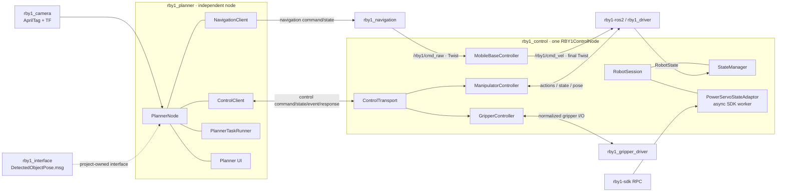

# RBY1 Project Architecture

## Runtime structure



## Package ownership

```text
rby1_project/
├── rby1_interface/          project-specific ROS messages
├── rby1_control/            single robot-facing control node
│   └── rby1_control/
│       ├── control_node.py
│       ├── control_transport.py
│       ├── state_manager.py
│       ├── robot_session.py
│       ├── power_servo_state_adaptor.py
│       ├── mobile_base_controller.py
│       ├── manipulator_controller.py
│       └── gripper_controller.py
├── rby1_navigation/         odometry controller; cmd_raw producer only
├── rby1_planner/            planner-owned client, task runner, and UI
├── rby1_camera/             perception and camera transforms
├── rby1_bringup/            hardware/sensor launch
└── robot_hardware/          hardware-specific drivers
```

Removed packages: `rby1_control_ui`, `rby1_state_monitor`.

## Command and state rules

1. `rby1_navigation` and any future base policy publish raw `Twist` to
   `/rby1/cmd_raw`.
2. `MobileBaseController` applies freshness and robot-safety checks.
3. Only `RBY1ControlNode` publishes the final `/rby1/cmd_vel`.
4. The planner controls stream lifetime over the control protocol; navigation
   has no driver-service dependency.
5. Driver `RobotState` and SDK power/servo samples meet in `StateManager`.
6. Project-specific interfaces belong to `rby1_interface`; the upstream
   `rby1-ros2` working tree remains unmodified.

`DetectedObjectPose` is retained as the project-owned direct-pose interface.
The current production camera path uses `AprilTagDetectionArray` plus TF, so no
runtime publisher/subscriber is forced onto the compatibility message.

## Supporting changes outside the six requested package operations

The following supporting files were changed because the requested runtime
graph would otherwise be inconsistent:

- `run_planner_ui.sh`: removed the deleted monitor process and passes the SDK
  robot address/model to the control launch;
- package manifests, setup files, launch/config files: updated executables and
  dependencies after package ownership changed;
- tests and documentation: imports and stream-lifecycle expectations updated
  to the new boundaries.

No unrelated camera, LiDAR, bringup, or hardware-driver behavior was changed
as part of this refactor.
