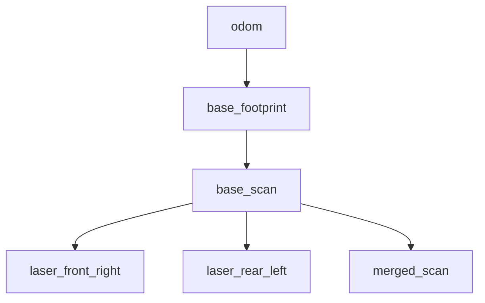

# RBY1 ROS 2 Development Log

Current package ownership and runtime data flow are documented in
[ARCHITECTURE.md](ARCHITECTURE.md). The standalone `rby1_control_ui` and
`rby1_state_monitor` packages have been removed; use `rby1_planner` for the
operator UI and the single `rby1_control` node for robot-facing control.

## 2026-07-27
### Contributor
- Woo, Kim, Hur

### Environment and Packages

1. ROS 2 Humble
2. RBY1 ROS 2 driver
3. LakiBeam LiDAR driver
4. `robot_hardware` package
   - LiDAR (Completed)
   - Camera (TODO)
5. `rby1_bringup` package
   - LiDAR launch configuration

### Launch the RBY1 ROS 2 Driver

```bash
c
```

### Launch the LiDAR Bringup

```bash
source /opt/ros/humble/setup.bash
source ~/rby1_ros2_ws/install/setup.bash

ros2 launch rby1_bringup lidar.launch.py
```

---

## 2026-08-13
### Contributor
- Woo

### Completed Work

1. Added `scan_merger_node.py` to the LakiBeam package.
   - Updated `CMakeLists.txt`.
   - Updated `package.xml` dependencies:
     - `tf2_ros`
     - `message_filters`
     - `python3-numpy` (`exec_depend`)

2. Tested scan-topic synchronization.
   - Test directory: `/home/lidar_test`
   - Pairing interval: `dt < 20 ms`
   - Pairing success rate: `100%`
   - Current handling of overlapping scan regions:
     - `min(range_FR, range_RL)`
   - TODO: filtering or something else...

3. Modified the TF structure.



4. Updated `lidar.launch.py`.
   - Added `scan_merger_node`.
   - Added the `base_footprint -> base_scan` TF.

5. Created the GitHub repository.

### TODO

- [x] Implement the mobile-base controller. (Done - 26/08/20)
- [ ] Test odometry accuracy.
- [ ] Create the SLAM, AMCL, and Nav2 package.
- [ ] Create the camera package.
- [ ] Improve filtering or fusion in overlapping LiDAR scan regions.
---

## 2026-08-20

### Contributor
- Kang, Woo, Kim

### Completed Work

1. Update: Control UI Sim --> Real
   - No Problem at mobile base
   - Joint state issue --> TODO

2. Add Dependency "sensor_msg" to control ui (real)
   - check difference with control ui package (sim)

### Launch Planner UI (current)

```bash
source /opt/ros/humble/setup.bash
source ~/rby1_ros2_ws/install/setup.bash

ros2 launch rby1_planner planner_ui.launch.py
```
topic number
ros2 topic info /rby1/joint_states --verbose


### TODO

- [ ] Check Control UI issue with joint
- [ ] Check dependency issue with "sensor_msg"
---
