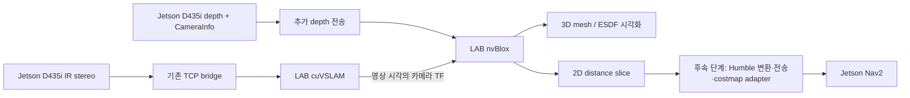

# RBY1 nvBlox 도입 검토

검토일: 2026-10-02. 저장소 코드와 NVIDIA Isaac ROS release-4.5 문서를 기준으로 작성했다. LAB/Jetson 접속, GPU 실행, 센서 데이터 측정은 수행하지 않았다. 아래 실험 수치는 도입 판단을 위한 제안이며 측정 결과가 아니다.

## 판단

**LAB PC에서 cuVSLAM과 함께 nvBlox를 실행하는 제한적 PoC를 권장한다.** 우선 깊이 기반 3D 지도/ESDF를 시각화하고, 검증 후 Jetson Nav2의 장애물 입력으로 확장한다. 위치 추정은 cuVSLAM이 담당하고 nvBlox는 깊이와 카메라 pose로 주변 공간을 재구성한다. nvBlox 도입만으로 VSLAM tracking loss나 global localization 문제가 해결되지는 않는다.

목표가 로봇 위치 추정뿐이면 우선순위가 낮다. 목표가 2D LiDAR 높이 밖의 장애물 인식, 3D 환경 모델, 향후 팔 주변 충돌 검사라면 도입 가치가 높다. 깊이 카메라 시야에 들어오는 물체에 한해 개선을 기대할 수 있다. 팔 충돌 검사에는 별도의 3D planner 연결과 로봇 몸체 제거가 필요하다.

공식 구성은 depth/pose 기반 3D 재구성과 Nav2 costmap 연동을 지원한다. [NVIDIA 개요](https://nvidia-isaac-ros.github.io/v/release-4.5/repositories_and_packages/isaac_ros_nvblox/index.html)

## 현재 코드에서 확인한 조건

| 항목 | 현재 상태 | 의미 |
|---|---|---|
| 실행 분리 | UPC/Jetson Humble, LAB Jazzy | 기존 TCP 분리를 확장해야 함 |
| LAB 구성 | `lab_setup.md`: Ubuntu 24.04, RTX 5080, driver 580, Isaac ROS 4.5 | 문서상 LAB 구성은 nvBlox 후보 환경과 부합; 실장비 확인 필요 |
| 카메라 | D435i IR 640×480×30 Hz | 기존 stereo 입력 유지 가능 |
| depth/color | `d435i.yaml` 및 launch 기본값 false | depth를 켜야 함; 최초 PoC에는 color 선택 사항 |
| 전체 실물 launch | `physical.launch.py`가 depth/color false를 직접 전달 | camera YAML만 변경하면 depth 활성화가 덮어써짐 |
| TCP schema | `wire.py`: stereo 두 영상만 binary 허용 | depth packet, CameraInfo, 수신 publisher 추가 필요 |
| 영상 검증 | `bridge_node.py`: mono8/8UC1만 허용 | 기존 IR 검증에 depth를 통과시키면 안 됨 |
| pose/TF | LAB `vslam_map → vslam_odom → d435_link` | 카메라 내부 TF와 함께 depth optical frame까지 연결 확인 |
| 카메라 장착 | 머리 `link_head_2`, 잠정 장착값 | base로의 변환은 영상 시각의 관절 TF와 실측 외부 보정 필요 |
| Nav2 | local/global 모두 `/scan` ObstacleLayer | nvBlox 결과가 자동으로 주행에 반영되는 구조가 아님 |
| 현재 global costmap | 20 m rolling window, static layer 없음 | 장기 전역 지도와 별도 검토 필요 |

근거 파일: `../launch/{d435i,upc,physical,lab}.launch.py`, `../config/{d435i,isaac_vslam,navigation,bridge}.yaml`, `../rby1_vslam/{wire,bridge_node}.py`, `lab_setup.md`.

## 권장 데이터 경로



첫 PoC는 color를 끄고 native depth + 해당 CameraInfo를 보낸다. depth의 encoding, 단위, stride, endian, 원본 timestamp/frame_id를 보존한다. nvBlox는 float depth를 m, uint16 depth를 mm로 해석하므로 RealSense 실제 depth scale도 확인한다. color는 mesh 색상과 사람 segmentation 단계에서 추가한다. [공식 입출력 API](https://nvidia-isaac-ros.github.io/v/release-4.5/repositories_and_packages/isaac_ros_nvblox/isaac_ros_nvblox/api/topics_and_services.html)

### 통합 선택

| 방식 | 장점 | 부담 | 권고 |
|---|---|---|---|
| LAB에서 Isaac ROS 4.5 nvBlox 실행 | 기존 cuVSLAM pose와 GPU 환경 활용 | depth 전송, 이후 Humble costmap 연결 | 최초 PoC |
| Jetson에 Humble 계열 wrapper 구성 | 네트워크 왕복 감소, Nav2와 같은 배포판 | Jetson 모델/JetPack 확인, 구버전 고정, GPU 자원 측정 | 후속 비교 |
| core C++/CUDA 직접 연동 | ROS wrapper와 별개로 구성 가능 | ROS 입출력, 지도 수명 관리, planner 연결 직접 구현 | 특별한 요구가 있을 때 |

release-4.5 wrapper의 공식 지원은 Jazzy다. x86 조건은 Ubuntu 24.04, Ampere 이상 GPU/8 GB 이상 GPU 메모리, CUDA 13.0+, driver 580+이며 Jetson 표는 Thor/JetPack 7.1을 명시한다. 이를 현재 Humble Jetson에 그대로 적용할 수 있다고 가정하지 않는다. core 라이브러리의 지원 범위와 ROS wrapper 지원 범위도 구분한다. [wrapper 지원 환경](https://nvidia-isaac-ros.github.io/v/release-4.5/repositories_and_packages/isaac_ros_nvblox/index.html), [core 설치 조건](https://nvidia-isaac.github.io/nvblox/v0.0.10/pages/installation.html)

## 주요 검증 항목

1. **IR projector와 추적의 동시 품질.** 현재 emitter는 0이다. texture가 부족하면 passive depth 품질이 떨어질 수 있지만 projector 패턴은 VSLAM 추적을 방해할 수 있다. 현 설정을 기준으로 depth 유효율과 추적 성능을 먼저 측정하고 필요하면 emitter 교대/splitter 경로를 시험한다. 교대 시 실제 IR/depth 전달률과 metadata 일치도 확인한다. [공식 RealSense 문제 설명](https://nvidia-isaac-ros.github.io/v/release-4.5/repositories_and_packages/isaac_ros_nvblox/isaac_ros_nvblox/troubleshooting/troubleshooting_nvblox_realsense.html)
2. **시각과 좌표계.** 수신 시각을 영상 timestamp로 덮어쓰지 않는다. 두 PC clock offset, 영상-카메라 TF 보간 가능 여부, tracking freshness를 측정한다. LAB 카메라 중심 지도 PoC는 base 관절 TF 없이 가능하지만 주행 costmap의 frame 변환 및 몸체 제거에는 로봇 TF 경로가 필요하다.
3. **loop closure/relocalization.** `vslam_odom`은 연속적인 local 재구성 후보, `vslam_map`은 loop closure로 보정되는 frame이다. 이 프로젝트에서 pose가 바뀔 때 기존 TSDF가 어떻게 유지되는지 검증하고 reset/rebuild 정책을 정한다. 과거 통합 voxel이 자동으로 전체 최적화된다고 가정하지 않는다. 세션 재연결·카메라 재시작도 같은 항목으로 시험한다.
4. **Humble↔Jazzy costmap.** 공식 출력은 `nvblox_msgs/DistanceMapSlice`이며 일반 `OccupancyGrid`와 다르다. 배포판 간 DDS 직접 연결이나 Jazzy plugin binary의 Humble 재사용을 전제로 삼지 않는다. Humble에 맞는 plugin/source port+slice 전송, 또는 OccupancyGrid 변환+별도 layer를 선택해야 한다. occupied/free/unknown, frame, 원점, 해상도, 거리→cost 변환, TTL과 장애물 제거를 함께 검증한다.
5. **RBY1 형태와 관측 범위.** 머리 움직임, 팔/손의 자기 관측, 카메라 사각지대, 테이블 상판/돌출부를 시험한다. 2D ESDF 생성 높이 범위는 base만이 아니라 주행 중 로봇 충돌 범위에 맞춘다. 이것이 움직이는 팔의 3D 충돌 검사를 대체하지는 않는다.
6. **동적 장애물과 메모리.** static 모드 기준선 이후 dynamic 모드를 비교한다. 사라진 물체가 남는지, 미관측 영역이 어떻게 취급되는지 확인한다. voxel 5 cm부터 시작하고 local 공간 보존 범위를 제한한다. 고해상도·장거리 누적은 GPU 메모리 증가를 유발한다. [mapping modes](https://nvidia-isaac-ros.github.io/v/release-4.5/concepts/scene_reconstruction/nvblox/technical_details.html), [core 제한](https://nvidia-isaac.github.io/nvblox/v0.0.10/pages/limitations.html)

### 대역폭 추정

640×480, padding 없는 raw payload, 30 Hz 기준으로 `width × height × bytes_per_pixel × fps × 8`을 계산했다. TCP/ROS header, 재전송, 실제 stride는 제외했다.

| 입력 | 대역폭 |
|---|---:|
| 기존 IR mono8 두 장 | 147.5 Mbps |
| 추가 depth uint16 한 장 | 147.5 Mbps |
| IR + depth 합계 | 294.9 Mbps |
| 추가 RGB8까지 포함 | 516.1 Mbps |

1 Gbps 유선은 초기 후보이나 실효 전송 지연을 측정해야 한다. depth가 stereo/IMU/pose를 밀어내지 않도록 전송 큐를 분리하고 오래된 depth는 버리는 정책이 필요하다. TCP 별도 연결 사용도 비교한다. 5×5 m/5 cm slice를 cell당 float32 하나로 보내면 10 Hz에서 약 3.2 Mbps이며, 이는 실제 메시지 구조와 부가 metadata를 제외한 추정이다.

## 단계별 도입 기준

| 단계 | 수행 | 다음 단계 조건 |
|---|---|---|
| 0. 기준선 | 기존 cuVSLAM tracking, 네트워크, GPU 사용량 기록; 실제 장비/version 확인 | 재현 가능한 bag과 기준선 확보 |
| 1. 입력 확장 | depth 전송 및 TF 확인, timestamp/encoding schema 검증 | 깊이 geometry 정상, 기존 tracking 악화 원인 해소 |
| 2. 지도 PoC | LAB mesh/ESDF만 생성, voxel 5 cm, 정적 장면 | 동일 벽/물체 중복·잔상 없음, GPU 메모리 안정 |
| 3. 장애물 비교 | 상판·돌출부·저상 장애물·사람 이동·머리 회전·재위치 추정 | 기존 `/scan` 대비 개선과 누락/오탐 수치 확보 |
| 4. Nav2 연결 | Humble adapter와 slice freshness gate, 저속 주행 | stale 지도 정지/축소 운용 정책 및 장애물 제거 검증 |

PoC 제안 목표는 depth 통합 15–30 Hz, costmap 10 Hz, 영상 취득→slice 사용 p95 지연 150 ms 이하, 30분 연속 실행에서 지연/메모리의 지속 증가 없음이다. 150 ms 동안 현재 최대 평면 속도 0.15 m/s로 약 2.25 cm 이동한다. 이 수치만으로 충돌 여유가 확보되는 것은 아니며 braking 거리, TF/깊이 오차, 로봇 footprint를 합쳐 결정한다. 목표를 충족하지 못하면 해상도·rate·ROI를 조정하고 재측정한다.

## 후속 구현 범위

- `d435i/upc/physical.launch.py`: depth 옵션 전달, 실험용 camera 설정 분리.
- `wire.py`, `bridge_node.py`, transport: depth packet과 calibration 전달, 크기/encoding 검증, 큐와 재연결 정책, protocol version 협상.
- LAB launch/config: release-4.5 nvBlox component, depth remap, TF/global frame, local map 범위, color/mesh 발행률 설정.
- 신규 Humble costmap adapter: 데이터 전송 및 freshness 상태, unknown/clearing semantics, 기존 `/scan`과 결합.
- 변경 시 검증: schema 왕복 및 비정상 packet, stale/reordered 영상, 재연결, pose jump/map reset, costmap clearing과 stale 정지. 실제 rosbag 재생과 저속 실물 시험을 별도로 수행.

현재 검토의 결정은 **3D mapping PoC 진행 권장, 운영 주행 적용은 실측 후 결정**이다. 예상 주효과는 위치 추정 개선보다 높이 정보를 활용한 장애물 인식 개선이다.

## 추가 검토: 정확한 wheel odometry + LiDAR + cuVSLAM

사용자 전제: wheel odometry가 상당히 정확하다. 이 경우 nvBlox의 pose를 반드시 cuVSLAM에서 얻을 필요는 없다. 연속적인 wheel odometry와 영상 시각의 로봇 관절 TF로 depth camera pose를 만들고, cuVSLAM/LiDAR SLAM은 전역 위치 보정에 활용하는 설계를 권장한다. 아래는 설계안이며 현재 실행 설정을 변경한 것은 아니다.

### 확인된 LiDAR 구성

`rby1_bringup/launch/lidar.launch.py`는 LakiBeam1L 앞오른쪽/뒤왼쪽 두 대를 30 Hz로 설정하고, `/scan_front_right`와 `/scan_rear_left`를 `/scan`으로 합친다. 설치 평면은 설정상 base_footprint 기준 0.185 m이다. 따라서 현재 사용 경로는 2D LaserScan이다. PointCloud2로 변환하더라도 관측 높이 정보가 새로 생기지는 않는다. nvBlox의 공식 LiDAR 입력은 3D LiDAR pointcloud와 sensor intrinsic을 전제로 하므로 현재 2D scan은 Nav2/LiDAR SLAM 경로에 두는 것이 간단하다. [nvBlox 입력 API](https://nvidia-isaac-ros.github.io/v/release-4.5/repositories_and_packages/isaac_ros_nvblox/isaac_ros_nvblox/api/topics_and_services.html)

LiDAR launch의 주석과 실제 y 좌표/port 값은 일부 다르므로 물리 장착값과 실제 파라미터를 확인한다. 합쳐진 scan을 SLAM에 쓰기 전 회전 중 시간 정합과 가상 scan origin에 의한 ray clearing 영향을 확인한다. 장애물 layer는 두 원본 scan을 각각 observation source로 사용하는 방식도 비교한다.

### 비교할 구성

| 구성 | 전역 위치/지도 | local 매핑 pose | 장애물 감지 | 적용 |
|---|---|---|---|---|
| A: wheel + nvBlox + LiDAR | 없음 또는 세션 시작 원점 | wheel + 관절 TF | depth nvBlox + LiDAR | 첫 비교 기준선, 근거리 상대 목표 |
| B: A + cuVSLAM | cuVSLAM의 global pose와 별도 전역 주행지도 | wheel + 관절 TF | depth nvBlox + LiDAR | 현재 VSLAM 연구 흐름에 가장 가까움 |
| C: A + LiDAR SLAM/localization + cuVSLAM 관측 | SLAM Toolbox로 지도 작성, 이후 AMCL 또는 SLAM Toolbox localization | wheel + 관절 TF | depth nvBlox + LiDAR | 실험실 반복 주행의 우선 비교 후보 |
| D: wheel/visual local estimator 융합 | 별도 global source | covariance를 검증한 local estimator | depth nvBlox + LiDAR | wheel slip 등 실제 문제 확인 후 |

정확한 wheel이라는 전제에서는 A→B/C 비교를 먼저 수행한다. 여러 estimator를 넣는 것 자체가 정확도를 보장하지 않는다. D를 구현할 때에는 loop-closure로 점프하는 SLAM pose를 연속적인 local odom에 그대로 융합하지 않는다. cuVSLAM 내부에 wheel odometry factor를 추가하는 기능이 있다고 가정하지 않으며, 여기서의 결합은 외부 TF/estimator 수준이다.

LiDAR의 2D occupancy map은 방·복도 연결과 우회 경로를 제공하고, depth nvBlox는 LiDAR 높이에 없는 장애물을 local costmap에 추가한다. 전역 지도 작성과 AMCL의 저장 지도 localization은 Nav2의 표준 경로다. [Nav2 mapping/localization](https://docs.nav2.org/rolling/configuration_and_development/first_time_robot_setup_guide/sensors/mapping_localization/)

### 좌표계와 pose 구성

```text
map                          ← 선택한 global localization source 하나
 └─ odom                     ← wheel 기반 연속 좌표계
     └─ base_footprint/base   ← driver
         └─ torso/head/...   ← joint_states + robot_state_publisher
             └─ depth optical frame
```

영상 시각 t에서 `T_odom_depth(t) = T_odom_base(t) × T_base_depth(t)`로 nvBlox pose를 구성한다. RBY1은 머리와 몸통이 움직이므로 camera mount가 base에 고정됐다고 취급하면 안 된다. 실제 roll/pitch/높이 변화가 있다면 2D wheel pose만으로 6DoF camera pose가 충분하지 않을 수 있으며, 관절 모델과 필요한 IMU 자세 보정을 검증한다.

nvBlox는 `global_frame: odom`으로 local reconstruction을 만들고, base 주변 범위 밖의 map을 clear한다. 파라미터 이름의 global_frame은 저장 좌표계를 뜻하며 반드시 ROS map frame을 의미하지 않는다. 공식 기본 frame도 odom이다. local 지도 유효 시간/거리 내 wheel drift가 depth 지도 해상도와 충돌 여유보다 충분히 작아야 한다. [nvBlox frame/clearing 파라미터](https://nvidia-isaac-ros.github.io/v/release-4.5/repositories_and_packages/isaac_ros_nvblox/isaac_ros_nvblox/api/parameters.html)

cuVSLAM을 global source로 선택하면 동일 시각의 base pose로 `T_map_odom(t) = T_map_base_visual(t) × inverse(T_odom_base_wheel(t))`를 계산한다. 현재 `localization_tf.py`는 이 구조를 평면 보정으로 구현하고 있다. 따라서 기존 driver의 odom authority를 바꿀 필요가 없다.

LiDAR localization과 cuVSLAM은 각자 pose를 계산할 수 있지만 map→odom TF 발행자는 하나로 제한한다. 다른 estimator는 별도 frame/topic으로 관측한다. 두 지도의 원점/방향을 정합하고 동일 시각·동일 base 기준으로 변환한 뒤 차이를 비교해야 한다. 추후 source 전환 시에는 frame 정합, 신뢰도, 전환 이력, 정지/재계획 절차가 필요하며 단순 평균이나 즉시 fallback은 권장하지 않는다.

### local/global 지도 분리의 효과

global correction이 바뀌어도 odom에 저장한 local nvBlox voxel은 그 보정 때문에 다시 휘어지지 않는다. Nav2 global planner는 map frame의 전역 지도와 보정된 위치를 쓰고, local controller는 odom frame에서 LiDAR+nvBlox 장애물을 쓴다. global 경로는 새 보정에 맞춰 재계획한다. 이것은 장기간 누적한 전역 3D 지도를 loop closure로 최적화하는 기능과는 별개다.

전역 3D 지도가 필요하면 local PoC 이후 corrected pose로 bag을 재통합하거나 submap 기반 처리 방안을 따로 검토한다. 저장한 cuVSLAM 특징점 지도와 LiDAR occupancy map, nvBlox voxel 지도는 용도가 다른 산출물이다.

### 현재 분산 구조에서 추가로 필요한 것

- UPC에서 영상 시각의 `T_odom_depth`를 계산해 LAB으로 전달하거나, wheel odom 및 필요한 동적 관절 TF를 LAB으로 전송한다. 현재 TCP의 camera 내부 static TF만으로는 wheel 기반 카메라 pose를 만들 수 없다.
- LAB에서 wheel camera pose 기반 nvBlox와 cuVSLAM을 병렬 실행한다. nvBlox slice를 UPC의 Humble adapter로 반환하고 원본 LiDAR 장애물 입력과 결합한다.
- LiDAR 중심안을 시험할 때 AMCL/SLAM Toolbox를 UPC에 배치하고 map→odom authority를 교체한다. cuVSLAM의 결과는 관측용으로 둔다. RBY1의 횡이동에 맞는 localization motion model도 확인한다.
- 현재 `localization_tf.py`/`nav2_gate_core.py`는 visual tracking 상실 시 보정 해제 및 정지를 수행한다. wheel 기반 nvBlox가 계속 동작해도 현 코드로 자동 주행 지속은 불가능하다. 독립 운용을 구현하려면 global/local localization과 depth/scan freshness 조건을 명시적으로 분리해야 한다.

### 비교 실험과 선택

같은 주행에서 wheel pose, 두 원본 scan, IR stereo, depth, CameraInfo, 관절 TF를 수집한다. A와 B/C를 동일 bag으로 비교하고, 이후 저속 실물 실험을 한다. 왕복/폐경로 endpoint 오차, local 지도 벽 두께·중복, map 위치 재현성, camera tracking 상실 빈도, 돌출물 감지, p95 장애물 지연, 재시작 후 localization 시간으로 평가한다. wheel-camera pose와 visual-camera pose를 쓰는 nvBlox도 각각 비교한다.

실험실 반복 주행에는 C를 우선 후보로, 현재 cuVSLAM 개발의 연속성에는 B를 우선 후보로 둔다. 양쪽 모두 **wheel은 연속 운동, 선택한 SLAM/localizer는 전역 위치, nvBlox는 3D local 장애물, LiDAR는 낮은 높이의 주변 장애물**이라는 역할 분담을 유지한다.
