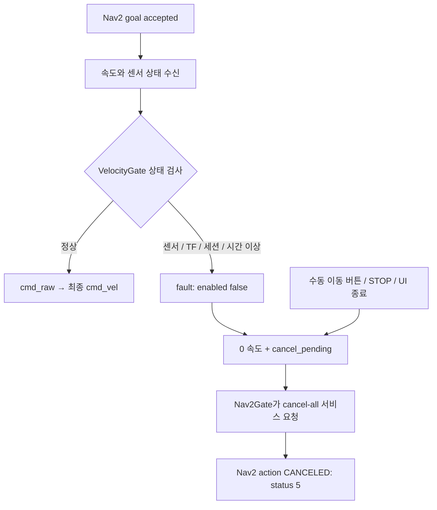

# 초기 웨이포인트 좌표와 Nav2 중간 정지 조사

조사일: 2026-10-01 (KST). 기준 코드: `84d510c` 및 저장된 `data/rby1_vslam_waypoints.yaml`.
사용자 관측: mapping 시작 직후 Point 1 저장, 이동 후 Point 2 저장, Navigate goal accepted 이후 state/status 5와 중간 정지.

이 문서는 저장 파일과 코드 및 ROS 2 Humble 공식 소스를 조사한 결과다. 어제의 rosbag/노드 로그는 이 작업 폴더에서 발견하지 못했다. 따라서 어느 센서가 어느 시점에 실패했는지는 확정하지 않는다. 로봇 실행이나 timeout·안전 조건 변경은 수행하지 않았다.

## 확인된 포인트

| 포인트 | x [m] | y [m] | yaw [rad] | yaw [deg] |
|---|---:|---:|---:|---:|
| Point 1 | -0.147006 | -0.024010 | 0.002064 | 0.1183 |
| Point 2 | 0.371060 | 0.365657 | 0.246847 | 14.1433 |

두 점 사이의 평면 거리는 약 **0.6483 m**, 자세 차이는 약 **14.025°**다. 저장된 yaw는 rad이며 UI는 deg로 표시한다. 파일에 NaN이나 frame_id 오타 같은 명백한 형식 문제는 보이지 않는다. 이는 당시 추정 정확도나 현재 지도의 일치까지 증명하지는 않는다.

## 왜 Point 1은 0,0,0이 아닌가

### 코드에서 확인되는 이유

1. Isaac 설정의 `base_frame`은 로봇 `base`가 아니라 **`d435_link`**다.
2. `PoseAdapter.drain()`은 카메라 포즈를 `T_map_base(t) = T_map_camera(t) × T_camera_base(t)`로 변환한다.
3. `LocalizationTF.tick()`은 같은 측정 시각의 wheel TF로 `vslam_map→odom` 보정을 만든다.
4. `OperatorNode.current_pose()`는 TF의 `vslam_map→base`를 조회한다.
5. `_save_current()`는 그 x/y/yaw를 그대로 저장한다. 첫 저장점을 원점으로 만드는 연산은 없다.

즉 카메라 시작 위치가 지도 원점 부근이어도, 카메라 뒤쪽에 있는 로봇 base의 x는 음수가 될 수 있다. Point 1의 x=-14.7 cm는 이 설명과 일관된다. 다만 당시 전체 `base→link_head_2→d435_camera_center→d435_link` TF와 최초 카메라 포즈가 없으므로 -14.7 cm 전부가 장착 오프셋이라고 단정할 수는 없다. 설정의 mount_x=0.0464 하나만 전체 카메라-base 거리를 뜻하지도 않는다.

[NVIDIA의 frame 정의](https://nvidia-isaac-ros.github.io/v/release-4.1/repositories_and_packages/isaac_ros_visual_slam/isaac_ros_visual_slam/index.html)에서도 추정 포즈는 설정된 base_frame의 위치다. 프로젝트가 LAB에서 설정한 base_frame과 UPC가 웨이포인트에 사용하는 base_frame을 구분해야 한다.

초기 yaw 0.118°에는 초기 추정·장착 변환·저장 시점의 움직임 등의 영향이 있을 수 있다. UI를 띄운 순간이 cuVSLAM 초기화 순간과 같다는 보장도 없다. loop closure는 mapping 중 기존 추정 좌표를 보정할 수 있다.

### 확인 명령

로봇을 정지시킨 상태에서 UPC의 동일 ROS_DOMAIN_ID 터미널에서 각각 확인한다.

```bash
ros2 topic echo /rby1/vslam/camera_slam_odometry --once
ros2 topic echo /rby1/vslam/slam_odom --once
ros2 run tf2_ros tf2_echo d435_link base
ros2 run tf2_ros tf2_echo vslam_map base
```

최초 카메라 포즈가 identity 부근이면 camera→base 변환이 초기 base 좌표를 설명하는지 비교한다. 움직이는 중에 순서대로 찍은 다른 시각 표본을 그대로 비교하면 안 된다. 정확한 비교에는 rosbag의 동일 stamp 표본을 사용한다.

Point 1을 표시상 0으로 보고 싶으면 `T_start_base = inverse(T_map_start) × T_map_base`로 별도 시작점 기준 좌표를 계산할 수 있다. **기존 YAML의 Point 1만 0,0,0으로 편집하면 Nav2의 실제 목표가 지도 원점으로 바뀐다.** 전체 프레임과 목표 변환 없이 좌표만 바꾸지 않는다.

## status=5는 무엇인가

[Humble action_msgs/GoalStatus](https://github.com/ros2/rcl_interfaces/blob/humble/action_msgs/msg/GoalStatus.msg)의 정의:

| 값 | 의미 |
|---:|---|
| 1 | ACCEPTED: 수락 |
| 2 | EXECUTING: 실행 중 |
| 3 | CANCELING: 취소 진행 |
| 4 | SUCCEEDED: 목표 달성 |
| **5** | **CANCELED: 외부 취소 요청 후 취소 완료** |
| 6 | ABORTED: 서버가 실패 종료 |

현재 UI `_on_goal_result()`는 이 결과 숫자만 로그에 쓴다. 게이트의 state는 disabled/idle/forwarding/fault 문자열이므로 UI의 goal finished(status=5)였다면 action 결과다. accepted→5는 목표 수락 후 취소되었다는 뜻이며, 정상 도착을 의미하지 않는다. 목표 수락은 센서/제어 상태가 이후에도 정상이라는 보장이나 전체 경로 성공의 보장이 아니다.

## 현재 코드에서 취소가 생기는 경로



### 1순위: 실시간 포즈·TF·tracking의 순간적인 끊김

| 현재 코드 기본 제한 | 조건 |
|---|---|
| PoseAdapter max_input_age_sec | 카메라 포즈가 0.5초 초과로 늦으면 폐기 |
| PoseAdapter tf_wait_sec | 측정 시각 camera→base TF를 0.15초 이내 확보하지 못하면 해당 표본 폐기 |
| LocalizationTF pose_timeout_sec | SLAM 포즈 stamp/수신이 0.5초 초과로 오래되면 healthy=false |
| 게이트 wheel/SLAM timeout | 0.5초 |
| 게이트 bridge/localization timeout | 0.75초 |
| 브리지 tracking_timeout_sec | 0.5초 |
| 미래 timestamp 허용 | 관련 검사 기본 약 0.05초 |
| SLAM pose/correction jump | 연속 표본 간 0.5 m 또는 0.8 rad 초과 |

launch 인자나 ROS 파라미터로 바뀔 수 있으므로 실제 노드 값을 dump해야 한다. tracking이 한 번 false가 되거나 localization healthy가 false가 되어도 활성 게이트는 fault를 latch한다. 센서가 회복되어도 자동 주행 재개는 하지 않으며 취소 완료 후 명시적 enable과 새 goal이 필요하다.

평면 경로 전체 길이 0.648 m가 0.5 m보다 크다는 사실은 pose jump 오류를 의미하지 않는다. jump 검사는 연속 측정 사이의 불연속 변화에 적용된다. mapping loop closure 또는 잘못된 TF로 갑자기 좌표가 바뀌는 경우를 별도로 조사한다.

### “오래된 위치”의 구분

**실시간 포즈가 오래된 경우**는 위 경로로 중간 취소가 가능하다. 네트워크/연산 지연, 표본 끊김, 측정 시각 TF 누락, UPC/LAB 시계 불일치, timestamp 역행 등을 확인한다.

**YAML을 어제 저장했다는 사실**은 이 timeout의 직접 원인이 아니다. YAML에는 stamp가 없고 `_after_enable()`는 새 goal의 header.stamp를 전송 당시 현재 ROS 시각으로 설정한다. 웨이포인트는 동일한 지도에 정합된 상태라면 오래 저장해 두고 재사용할 수 있다.

다만 새 mapping 세션을 시작했는데 옛 포인트를 그대로 불러오면 `vslam_map`이라는 문자열만 같고 실제 원점·방향은 다를 수 있다. 현재 파일은 map ID/session ID를 저장하지 않고 `load_waypoints()`도 frame 문자열만 검사하므로 이를 차단하지 못한다. 새 지도에서 다시 저장하거나 동일 지도 localization을 확보하는 것이 필요하다. 이는 목표 좌표의 의미 문제로, 파일의 날짜를 검사하는 오류와는 다르다.

### 2순위: UI 수동 개입 또는 다른 속도 발행자

`_start_manual()`은 `disable_and_cancel_navigation()`부터 호출한다. 주행 중 FORWARD/STRAFE/ROTATE를 누르면 기존 Nav2 goal을 취소하고 수동 조작으로 전환한다. SOFTWARE STOP과 UI 종료도 취소 경로다.

게이트는 cmd_raw publisher가 자기 자신을 포함하여 2개 이상이면 fault로 정지·취소한다. 기존 `rby1_navigation`이나 teleop 같은 다른 속도 생산자가 남아 있는지 `ros2 topic info /rby1/cmd_raw --verbose`로 확인한다. 게이트가 비활성이고 0을 주기 발행하지 않더라도 publisher 객체는 존재한다.

### 추가 구분: Nav2 planner/controller 실패와 최종 제어 차단

Nav2의 SimpleProgressChecker는 현재 설정으로 15초 안에 baseline에서 0.1 m 초과 평면 이동이 있어야 진행으로 본다. Humble 구현은 yaw 변화만을 진행 거리로 세지 않는다. 목표 주변 방향 정렬 지연이나 최종 cmd_vel 차단으로 움직이지 못하면 progress failure의 후보가 된다. 이것만으로 status=5의 원인을 설명할 수는 없으며 보통 서버 실패 상태 6과 구분해서 조사한다. [Humble 구현](https://github.com/ros-navigation/navigation2/blob/humble/nav2_controller/plugins/simple_progress_checker.cpp)

목표 판정에는 x/y뿐 아니라 저장 yaw도 사용한다. 현재 허용 오차는 위치 0.01 m, yaw 0.0174533 rad(1°). 두 점 yaw 차이는 약 14°이므로 위치에 접근한 뒤 회전 단계가 필요할 수 있다. DWB의 RotateToGoal은 목표 근처에서 감속/회전 제약을 적용한다. 실제 controller 로그에 trajectory/progress 오류가 있는지 확인한다. [Humble RotateToGoal](https://github.com/ros-navigation/navigation2/blob/humble/nav2_dwb_controller/dwb_critics/src/rotate_to_goal.cpp)

`rby1_control`도 별도 안전 상태를 검사해 최종 속도를 0으로 만들 수 있다. `/rby1/vslam/nav2_cmd_vel`, `/rby1/cmd_raw`, `/rby1/cmd_vel`을 함께 기록하면 어느 단계에서 막혔는지 구분할 수 있다. Nav2 goal 결과만으로 최종 드라이버가 속도를 받았는지 알 수 없다.

## 디버깅 순서

### 1. 취소 직전 원인을 먼저 본다

각 명령은 별도 UPC 터미널에서 실행한다. 동일한 ROS workspace와 ROS_DOMAIN_ID가 필요하다.

```bash
ros2 topic echo /rby1/vslam/navigation_status
ros2 topic echo /rby1/vslam/localization_status
ros2 topic echo /rby1/vslam/bridge_status
```

navigation_status에서 state, detail, input_guard, cancel_pending, session_id를 본다. `input_guard`는 현재 상태라서 원인이 회복된 뒤 비어 있을 수 있다. latch된 `detail`과 취소 전후의 시간 순서를 함께 읽는다. localization_status의 healthy/detail과 bridge_status의 connected/tracking_ok/tracking_age_sec/session_id로 상위 원인을 좁힌다.

| 관측 메시지 | 우선 조사 |
|---|---|
| `base SLAM pose ... stale` | camera_slam_odometry→PoseAdapter→slam_odom의 stamp/지연 |
| `waiting for acquisition-time ... TF` | camera→base 및 odom→base가 같은 측정 시각에 존재하는지 |
| `VSLAM pose timestamp stale/future` | UPC/LAB 시계와 end-to-end 지연 |
| `bridge ... tracking ...` | LAB cuVSLAM 상태·영상·TCP 세션 |
| `global correction jumped` / `SLAM pose jumped` | loop closure, pose 불연속, TF 권한 충돌 |
| `another ... cmd_raw publisher` | 중복 navigation/teleop 노드 |
| `operator canceled` / `disabled by operator` | 수동 버튼·STOP·다른 서비스 클라이언트 |
| `Nav2 command absent or timed out` | Nav2 속도 생성·smoother; 이 조건만으로 게이트 취소하지 않음 |

### 2. 실제 데이터와 최종 속도를 같이 남긴다

이번 조사에서 [capture_navigation_debug.sh](../scripts/capture_navigation_debug.sh)를 추가했다. 상태/포즈/TF/속도/ROS 로그/action 상태를 읽어 기록하며 로봇 이동·enable·cancel 서비스를 호출하지 않는다.

```bash
source /opt/ros/humble/setup.bash
source ~/rby1_ros2_ws/install/setup.bash
# 로봇 stack과 같은 ROS_DOMAIN_ID를 이 터미널에도 적용한다.
cd ~/rby1_ros2_ws/src/rby1-project/rby1_vslam
bash scripts/capture_navigation_debug.sh
```

파라미터 snapshot 수집 후 rosbag recorder가 구독을 시작한 것을 확인하고 Point 1→2를 시도한다. 같은 실행 세션에서, 수동 버튼을 누르지 않고 하나의 goal이 status 4로 완료된 뒤 반대 point를 선택한다. 결과가 5이면 원인 상태를 기록하고 센서/취소 장벽이 회복된 뒤 새 goal을 보낸다. UI에는 자동 왕복 반복 기능이 구현되어 있지 않다.

기록은 Ctrl+C로 종료한다. 결과는 기본 `~/rby1_debug/vslam_<시간>_<고유값>/` 아래에 있으며, `bag`, node parameter dumps, cmd_raw 발행자 목록, 토픽 목록을 포함한다. 이미지 스트림은 기록하지 않는다. `source_waypoints.yaml`은 스크립트 옆 소스 패키지의 기본 파일 복사본이며 경로를 override한 UI 파일과 다를 수 있으므로 waypoint_ui parameter dump도 확인한다.

### 3. 시계·TF·주기를 확인한다

UPC와 LAB에서 `date -u` 및 사용 중인 NTP 도구의 동기화 상태를 확인한다. 단순 date 출력은 50 ms 정밀도 검증이 아니며 가능하면 chrony/systemd-timesyncd 상태를 함께 본다. `use_sim_time` 혼용이나 실행 중 wall clock 보정/역행도 확인한다.

`ros2 topic hz /rby1/vslam/slam_odom`은 도착 빈도를 알려주지만 stamp가 최신인지까지 증명하지 않는다. bag 기록 시각과 메시지 header.stamp의 차이를 구하고 camera_slam_odometry와 slam_odom을 연결해 어디서 표본이 없어지는지 확인한다. acquisition-time TF가 핵심이므로 `tf2_echo`의 현재 시각 성공만으로 과거 측정 시각의 TF를 보장할 수 없다.

Nav2 내부 planner/controller 원인은 `/rby1/vslam/nav2/controller_server`, planner_server, bt_navigator의 원래 터미널 로그와 `/rosout`에서 확인한다. Humble NavigateToPose 결과는 Empty이므로 UI 결과 숫자 자체에 상세 Nav2 오류 문구가 포함되지 않는다. [Humble action 정의](https://github.com/ros-navigation/navigation2/blob/humble/nav2_msgs/action/NavigateToPose.action)

## 현 구현에서 확인한 진단 한계와 후속 개선 후보

- UI는 status 숫자만 표시하고 goal UUID·취소 요청 주체를 이 결과 줄에 표시하지 않는다.
- 게이트 상태는 상단 label만 갱신하며 상태 변경 이력을 UI 로그에 누적하지 않는다. UI 목록도 최근 100줄만 유지한다.
- 웨이포인트 저장은 최신 TF 조회만 수행하고 그 TF의 age 또는 localization healthy를 저장 직전에 확인하지 않는다. 따라서 UI가 포즈를 읽었다는 것만으로 당시 최신 관측을 보장하지 않는다.
- YAML에는 map ID/session 정보가 없어 새 mapping 세션과 기존 포인트의 혼용을 검출하지 못한다.
- UI는 동시에 진행 중인 waypoint 전송을 제한하지 않고 self.goal_handle 한 개로 관리한다. 결과 callback에 UUID가 없어 연속 클릭 시 어느 goal의 결과인지 혼동할 수 있다. 이는 어제 원인으로 확인된 사실은 아니다.

필요한 개선은 상태명/UUID 표시, 상태 전환 이력, 저장 시 최신성 검사, 지도 식별 정보, 실행 중 goal 전송 관리다. 지금 조사에서는 주행 파라미터나 취소·안전 정책을 바꾸지 않았다. 먼저 rosbag으로 원인을 확인한 뒤 해당 경로를 수정하는 것이 적절하다.

## 로봇 없이 확인한 재현

현재 VelocityGate 코어를 직접 실행하여 정상 forwarding→SLAM 0.6초 경과→0 출력/fault/cancel_pending 전환을 확인했다. tracking false 입력도 같은 latch/취소 상태를 만든다. 반대로 건강한 센서에서 0.25초 넘는 명령 침묵은 0 출력/idle이며 enabled는 유지하고 cancel_pending은 만들지 않는 것을 확인했다.

이는 stale 실시간 포즈가 취소 요청으로 이어지는 코드 경로의 재현이다. ROS action 서버가 실제로 status 5를 반환하는 실물 통합 실험이나 어제의 원인 확정은 아니다.
